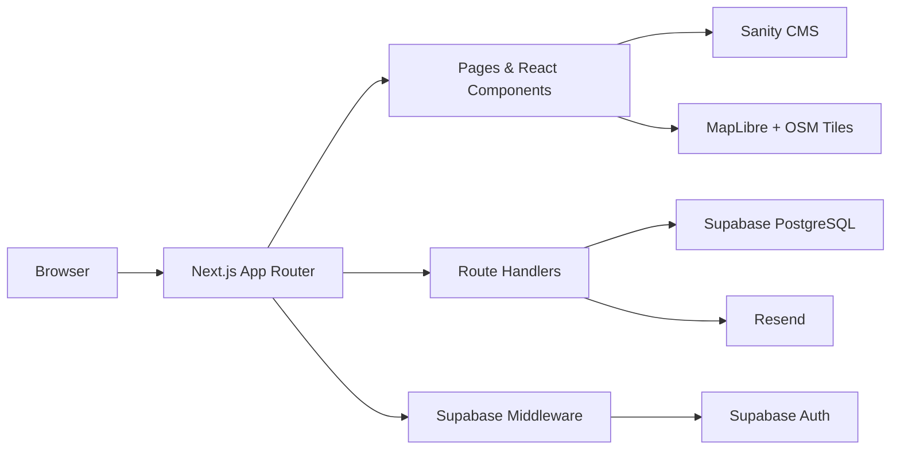

<!-- prettier-ignore -->
<div align="center">


# ITB Insight 2026 Demo Web

_Demo platform event untuk pameran teknologi ITB: landing page, auth peserta, katalog kompetisi, registrasi tim, dashboard, tiket QR, CMS, map venue, dan admin check-in._

[](https://nextjs.org)
[](https://www.typescriptlang.org)
[](https://tailwindcss.com)
[](https://supabase.com)
[](https://www.sanity.io)

[Overview](#overview) • [Features](#features) • [Tech Stack](#tech-stack) • [Getting Started](#getting-started) • [Project Structure](#project-structure)

</div>

## Overview

ITB Insight 2026 Demo Web is a production-style proof of concept for a campus tech exhibition experience. It is not just a static event page: visitors can authenticate, browse competitions, register a team, view their participant dashboard, generate QR tickets, explore venue locations, and let admins perform geofenced check-ins.

The project combines a modern [Next.js App Router](https://nextjs.org) frontend with [Supabase](https://supabase.com) for auth/database, [Sanity](https://www.sanity.io) for content, [Resend](https://resend.com) for email confirmation, and [MapLibre GL JS](https://maplibre.org) for the venue map.

> [!NOTE]
> Several public pages include fallback demo data, so the app can still be explored before Supabase and Sanity are fully configured.

## Features

- **Event landing page** with branded hero visuals, program highlights, countdown, and clear CTAs.
- **Supabase Auth** with Google OAuth and email magic link login.
- **Competition catalog** backed by Sanity CMS with local fallback content for development.
- **Team registration flow** with team-size validation, duplicate checks, Supabase inserts, and optional Resend confirmation email.
- **Participant dashboard** for registration summaries, status display, and QR ticket access.
- **Admin check-in** with admin email allowlist, QR lookup, and venue geofence validation.
- **Interactive venue map** using MapLibre and OpenStreetMap raster tiles, with filters for competition and exhibition venues.
- **Content pages** for news, gallery, about, and event metadata with Open Graph support.

## Tech Stack

| Area | Technology |
| --- | --- |
| Framework | [Next.js 14](https://nextjs.org) App Router |
| Language | [TypeScript](https://www.typescriptlang.org) |
| Styling | [Tailwind CSS 4](https://tailwindcss.com), shadcn-style components |
| UI & Motion | [Lucide React](https://lucide.dev), [Framer Motion](https://www.framer.com/motion), Three.js |
| Auth & Database | [Supabase](https://supabase.com) Auth, PostgreSQL, SSR helpers |
| CMS | [Sanity](https://www.sanity.io), GROQ queries, Portable Text schemas |
| Map | [MapLibre GL JS](https://maplibre.org), OpenStreetMap tiles |
| Email | [Resend](https://resend.com) |
| QR | [qrcode.react](https://github.com/zpao/qrcode.react) |
| Hosting Target | [Vercel](https://vercel.com) |

## Architecture



Business logic stays inside the Next.js app. Public pages render CMS-backed content, protected flows use Supabase sessions, `/api/register` handles registration writes plus optional confirmation email, and `/api/admin/check-in` validates QR check-ins with venue geofence rules.

## Getting Started

### Prerequisites

- [Node.js](https://nodejs.org) 20 or newer
- npm
- Supabase project for auth and database-backed flows
- Sanity project for CMS-backed competitions/news
- Resend API key if registration confirmation email is required

### Run Locally

```bash
npm install
npm run dev
```

Open [http://localhost:3000](http://localhost:3000) in your browser.

> [!TIP]
> `.npmrc` sets `legacy-peer-deps=true` because this demo uses a few packages with strict peer ranges while staying on Next.js 14 and React 18.

### Environment Variables

Create `.env.local` in the project root:

```bash
NEXT_PUBLIC_SITE_URL=http://localhost:3000

NEXT_PUBLIC_SUPABASE_URL=your-supabase-url
NEXT_PUBLIC_SUPABASE_ANON_KEY=your-supabase-anon-key
SUPABASE_SERVICE_ROLE_KEY=your-supabase-service-role-key

NEXT_PUBLIC_SANITY_PROJECT_ID=your-sanity-project-id
NEXT_PUBLIC_SANITY_DATASET=production
NEXT_PUBLIC_SANITY_API_VERSION=2024-01-01

NEXT_PUBLIC_EVENT_DATE=2026-11-15T08:00:00+07:00

RESEND_API_KEY=your-resend-api-key
RESEND_FROM_EMAIL="ITB Insight <noreply@example.com>"

ADMIN_EMAILS=admin@example.com,staff@example.com
```

> [!IMPORTANT]
> `SUPABASE_SERVICE_ROLE_KEY` is server-only. Never expose it through client components, browser code, or `NEXT_PUBLIC_*` variables.

### Useful Scripts

| Command | Description |
| --- | --- |
| `npm run dev` | Start the local development server |
| `npm run build` | Build the production bundle |
| `npm run start` | Start the production server after build |
| `npm run lint` | Run the configured Next.js lint command |
| `node scripts/verify-supabase.js` | Check Supabase REST endpoint connectivity |
| `node scripts/test-supabase-client.js` | Verify Supabase service-role client access |

## App Routes

| Route | Purpose |
| --- | --- |
| `/` | Landing page and event CTA |
| `/auth/login` | Google OAuth and magic link login |
| `/auth/callback` | Supabase auth callback route |
| `/competitions` | Competition list |
| `/competitions/[slug]` | Competition detail |
| `/dashboard` | Participant dashboard and registration status |
| `/dashboard/register-competition` | Team registration form |
| `/dashboard/my-tickets` | QR ticket page |
| `/admin` | Admin entry page |
| `/admin/check-in` | Admin QR check-in flow |
| `/map` | ITB venue map |
| `/gallery` | Media gallery |
| `/news` | News page |
| `/about` | Event overview |
| `/api/register` | Registration API endpoint |
| `/api/admin/check-in` | Admin check-in API endpoint |

## Project Structure

```text
demo-web/
├── app/                    # Next.js routes, pages, API handlers
├── components/             # Shared UI, landing, dashboard, map, and admin components
├── lib/                    # Supabase, Sanity, competition, registration, geofence helpers
├── public/                 # Static assets, brand logo, Open Graph image
├── sanity/                 # Sanity schemas
├── scripts/                # Local verification scripts
├── middleware.ts           # Supabase session refresh middleware
└── package.json
```

## Data & Content Notes

- Competition content is fetched from Sanity when Sanity env vars are present.
- Development fallback competitions live in `lib/competitions.ts`.
- Sanity schemas live in `sanity/schemas` for competitions, articles, and rich text content.
- Dashboard registrations are read from Supabase for the logged-in user.
- `/api/register` requires a valid Supabase bearer token, validates competition data, writes to `registrations`, and sends email when Resend is configured.
- QR tickets use the `rsvp` table, while admin check-in reads and updates the same table.
- Admin check-in is restricted by `ADMIN_EMAILS` and validates staff location against venue radiuses in `lib/geofence.ts`.
- Map uses MapLibre GL JS with OpenStreetMap raster tiles, so no map API key is required.
- Supabase Auth redirect URLs must include local and production callback URLs, for example `http://localhost:3000/auth/callback` and `https://your-domain.example/auth/callback`.

## Deployment

This app is ready for Vercel-style deployment.

1. Push the repository to GitHub.
2. Import the repository into Vercel.
3. Add the same environment variables from `.env.local` to Vercel project settings.
4. Use `npm run build` as the build command.
5. Set Supabase OAuth redirect URLs for the production domain.

> [!WARNING]
> Google OAuth and magic links will fail in production if Supabase redirect URLs are not configured for the deployed domain.

## Current Status

- Core Next.js app, visual landing, competitions, dashboard, map, news, gallery, about, and admin check-in pages are present.
- Supabase Auth helpers and middleware are wired.
- Registration API, Resend email path, QR ticket generation, and geofenced admin check-in are implemented.
- External services still need correct project-side configuration, database tables/RLS policies, OAuth redirect URLs, and production env vars before the demo is presentation-ready.
