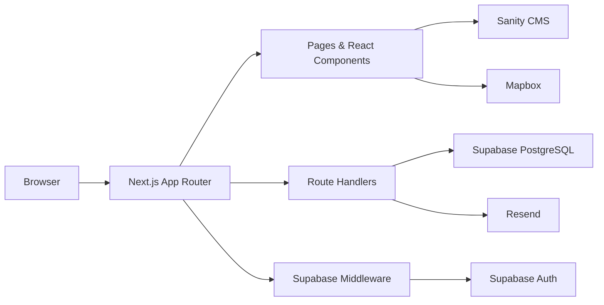

<div align="center">
  

  # ITB Insight 2026 Demo Web

  _Website demo untuk tech exhibition ITB: landing page, auth, kompetisi, dashboard peserta, CMS, map venue, dan email konfirmasi._

  [](https://nextjs.org)
  [](https://www.typescriptlang.org)
  [](https://tailwindcss.com)
  [](https://supabase.com)
  [](https://www.sanity.io)

  [Overview](#overview) • [Features](#features) • [Tech Stack](#tech-stack) • [Getting Started](#getting-started) • [Project Structure](#project-structure)
</div>

## Overview

ITB Insight 2026 Demo Web adalah proof-of-concept untuk platform peserta ITB Insight, tech exhibition besar di Institut Teknologi Bandung. Fokus utamanya sederhana: menunjukkan flow nyata dari publikasi acara sampai registrasi kompetisi, bukan sekadar landing page statis.

Demo ini menggabungkan frontend Next.js dengan layanan produksi seperti Supabase, Sanity, Mapbox, dan Resend. Konten kompetisi bisa datang dari CMS, pendaftaran masuk ke database, user login lewat Supabase Auth, dan peserta bisa memantau status dari dashboard.

> [!NOTE]
> Repository ini adalah demo application. Beberapa halaman sudah punya fallback data agar tetap bisa dibuka saat service eksternal belum dikonfigurasi.

## Features

- **Landing page event** dengan visual futuristik, program highlights, CTA, dan countdown.
- **Authentication** via Supabase: Google OAuth dan magic link email.
- **Competition catalog** dari Sanity CMS, lengkap dengan halaman detail per kompetisi.
- **Registration flow** untuk tim peserta, termasuk validasi jumlah anggota dan submit ke Supabase.
- **Participant dashboard** untuk melihat ringkasan registrasi, status, dan akses tiket.
- **Email confirmation** melalui Resend setelah registrasi berhasil diproses.
- **Interactive venue map** dengan Mapbox, marker lokasi ITB, dan filter tipe venue.
- **News, gallery, about, dan QR ticket pages** sebagai pelengkap experience event.
- **Production-friendly metadata** dengan Open Graph image dan remote image config untuk Sanity.

## Tech Stack

| Area | Technology |
| --- | --- |
| Framework | [Next.js 14](https://nextjs.org) App Router |
| Language | [TypeScript](https://www.typescriptlang.org) |
| Styling | [Tailwind CSS](https://tailwindcss.com), shadcn-style components |
| UI & Motion | [Lucide React](https://lucide.dev), [Framer Motion](https://www.framer.com/motion), Three.js |
| Auth & Database | [Supabase](https://supabase.com) Auth, PostgreSQL, SSR helpers |
| CMS | [Sanity](https://www.sanity.io) + GROQ queries |
| Map | [Mapbox GL JS](https://docs.mapbox.com/mapbox-gl-js/) |
| Email | [Resend](https://resend.com) |
| Deployment target | [Vercel](https://vercel.com) |

## Architecture



Business logic stays inside the Next.js app. Public pages render CMS-backed content, protected flows use Supabase sessions, and `/api/register` handles the registration write path plus optional confirmation email.

## Getting Started

### Prerequisites

- [Node.js](https://nodejs.org) 20 or newer
- npm
- Supabase project
- Sanity project
- Mapbox access token
- Resend API key, if email confirmation is needed

### Run Locally

```bash
npm install
npm run dev
```

Open [http://localhost:3000](http://localhost:3000) in your browser.

> [!TIP]
> You can browse several pages without external services because the app includes development fallbacks for competitions and registrations.

### Environment Variables

Create `.env.local` in the project root:

```bash
NEXT_PUBLIC_SITE_URL=http://localhost:3000

NEXT_PUBLIC_SUPABASE_URL=your-supabase-url
NEXT_PUBLIC_SUPABASE_ANON_KEY=your-supabase-anon-key
SUPABASE_SERVICE_ROLE_KEY=your-supabase-service-role-key

NEXT_PUBLIC_SANITY_PROJECT_ID=your-sanity-project-id
NEXT_PUBLIC_SANITY_DATASET=production
NEXT_PUBLIC_SANITY_API_VERSION=2024-01-01

NEXT_PUBLIC_MAPBOX_TOKEN=your-mapbox-token
NEXT_PUBLIC_EVENT_DATE=2026-11-15T08:00:00+07:00

RESEND_API_KEY=your-resend-api-key
RESEND_FROM_EMAIL="ITB Insight <noreply@example.com>"
```

> [!IMPORTANT]
> Never expose `SUPABASE_SERVICE_ROLE_KEY` in client components or `NEXT_PUBLIC_*` variables. Keep it server-only.

### Useful Scripts

| Command | Description |
| --- | --- |
| `npm run dev` | Start local development server |
| `npm run build` | Build production bundle |
| `npm run start` | Start production server after build |
| `npm run lint` | Run Next.js lint command |
| `node scripts/verify-supabase.js` | Check Supabase REST endpoint connectivity |
| `node scripts/test-supabase-client.js` | Test Supabase service-role client access |

## App Routes

| Route | Purpose |
| --- | --- |
| `/` | Landing page and event CTA |
| `/auth/login` | Google OAuth and magic link login |
| `/auth/callback` | Supabase auth callback route |
| `/competitions` | Competition list |
| `/competitions/[slug]` | Competition detail |
| `/dashboard` | Participant dashboard and registration status |
| `/dashboard/register-competition` | Team registration form |
| `/dashboard/my-tickets` | QR ticket page |
| `/map` | ITB venue map |
| `/gallery` | Media gallery |
| `/news` | Sanity-backed news list |
| `/about` | Event overview and stats |
| `/api/register` | Registration API endpoint |

## Project Structure

```text
demo-web/
├── app/                    # Next.js routes, pages, API handlers
├── components/             # Shared UI, landing, dashboard, and map components
├── lib/                    # Supabase, Sanity, competition, registration helpers
├── public/                 # Static assets, logo, OG image
├── sanity/                 # Sanity schemas
├── scripts/                # Local verification scripts
├── docs/                   # Phase notes and implementation guides
├── middleware.ts           # Supabase session refresh middleware
└── package.json
```

## Data & Content Notes

- Competition content is fetched from Sanity when Sanity env vars are present.
- Development fallback competitions live in `lib/competitions.ts`.
- Dashboard registrations are read from Supabase for the logged-in user.
- `/api/register` requires a valid Supabase bearer token, validates competition data, writes to `registrations`, then sends email when Resend is configured.
- Mapbox gracefully shows a missing-token state if `NEXT_PUBLIC_MAPBOX_TOKEN` is not set.

## Deployment

This app is designed to deploy cleanly on Vercel.

1. Push the repository to GitHub.
2. Import it into Vercel.
3. Set the same environment variables from `.env.local` in Vercel project settings.
4. Use `npm run build` as the build command and `.next` as the output directory.

> [!WARNING]
> Configure Supabase OAuth redirect URLs for both local and production domains, otherwise Google OAuth and magic link callbacks will fail after deployment.

## Current Status

- Core Next.js app, visual landing, competitions, dashboard, map, news, gallery, and about pages are present.
- Supabase Auth helpers and middleware are wired.
- Registration API and Resend email path are implemented.
- External services still need correct project-side configuration, schema/RLS setup, and production env vars before the demo is presentation-ready.
