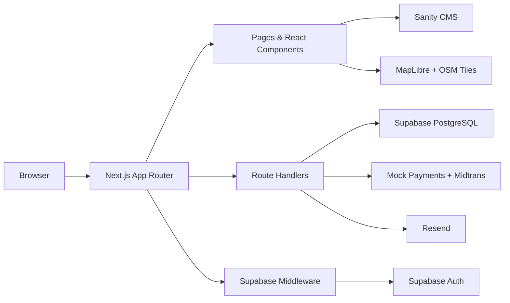

<!-- prettier-ignore -->
<div align="center">


# ITB Insight 2026 Web

_MVP platform ITB Insight untuk registrasi kompetisi, akun visitor, tiket QR, pembayaran tahap awal, dashboard peserta, dashboard admin, dan gate check-in._

[](https://nextjs.org)
[](https://www.typescriptlang.org)
[](https://tailwindcss.com)
[](https://supabase.com)
[](https://www.sanity.io)

[Overview](#overview) • [Features](#features) • [Tech Stack](#tech-stack) • [Getting Started](#getting-started) • [Project Structure](#project-structure) • [Docs](#docs)

</div>

## Overview

ITB Insight 2026 Web is the production web platform for the competition-registration flow. Visitors can authenticate, receive a QR ticket, browse competitions, register individually or through a team UID flow, pay through the staged payment flow, view their participant dashboard, and let admins review registrations or scan QR tickets at the gate.

The project combines a modern [Next.js App Router](https://nextjs.org) frontend with [Supabase](https://supabase.com) for auth/database, optional [Sanity](https://www.sanity.io) content fallback support, Midtrans Sandbox support for the payment phase, and [MapLibre GL JS](https://maplibre.org) for the venue map. The `resend` package is installed for future email paths, but no active route reads Resend environment variables yet.

> [!NOTE]
> Several public pages include fallback content, so the app can still be explored before Supabase and Sanity are fully configured.

## Features

- **Event landing page** with branded hero visuals, program highlights, countdown, and clear CTAs.
- **Supabase Auth** with Google OAuth and email magic link login.
- **Competition catalog** with hardcoded MVP fallback data and optional Sanity integration when configured.
- **Individual registration flow** with authenticated submission, duplicate checks, and submitted status.
- **Team registration flow** where leaders create teams, receive a team UID, members join by UID, and leaders submit final registration.
- **Participant dashboard** for individual/team registration summaries, status display, team UID visibility, and QR ticket access.
- **Visitor QR tickets** created through `visitor_tickets` and reused across sessions.
- **Payment flow** with internal mock settlement first and Midtrans Sandbox Snap support after configuration.
- **Admin dashboard** for overview metrics, registration search/review, payment visibility, status updates, visitor list, CSV export, and QR check-in.
- **Admin check-in** with browser QR scan or manual token input, no MVP geofence requirement.
- **Interactive venue map** using MapLibre and OpenStreetMap raster tiles, with filters for competition and exhibition venues.
- **Content pages** for news, gallery, about, and event metadata with Open Graph support.

## Tech Stack

| Area | Technology |
| --- | --- |
| Framework | [Next.js 14](https://nextjs.org) App Router |
| Language | [TypeScript](https://www.typescriptlang.org) |
| Styling | [Tailwind CSS 4](https://tailwindcss.com), shadcn-style components |
| UI & Motion | [Lucide React](https://lucide.dev), [Framer Motion](https://www.framer.com/motion), Three.js |
| Auth & Database | [Supabase](https://supabase.com) Auth, PostgreSQL, SSR helpers |
| CMS | [Sanity](https://www.sanity.io), GROQ queries, Portable Text schemas |
| Map | [MapLibre GL JS](https://maplibre.org), OpenStreetMap tiles |
| Email | [Resend](https://resend.com) |
| QR | [qrcode.react](https://github.com/zpao/qrcode.react) |
| Hosting Target | [Vercel](https://vercel.com) |

## Architecture



Business logic stays inside the Next.js app. Public pages render hardcoded or fallback content, protected flows use Supabase sessions, registration APIs handle individual/team submissions, payment APIs handle mock/Midtrans transactions, and admin APIs handle registration review, CSV export, visitor listing, and QR check-in.

## Getting Started

### Prerequisites

- [Node.js](https://nodejs.org) 20 or newer
- npm
- Supabase project for auth and database-backed flows
- Sanity project only if CMS-backed competitions/news are needed
- Midtrans Sandbox keys only if testing Midtrans payment flow
- Resend is reserved for future email confirmation paths; current code does not require Resend env vars

### Run Locally

```bash
npm install
npm run dev
```

Open [http://localhost:3000](http://localhost:3000) in your browser.

> [!TIP]
> `.npmrc` sets `legacy-peer-deps=true` because this project uses a few packages with strict peer ranges while staying on Next.js 14 and React 18.

### Environment Variables

Create `.env.local` in the project root for local development. Local values must point to the staging or disposable development Supabase project, not the clean production project used for real users.

```bash
NEXT_PUBLIC_SITE_URL=http://localhost:3000

NEXT_PUBLIC_SUPABASE_URL=your-supabase-url
NEXT_PUBLIC_SUPABASE_ANON_KEY=
SUPABASE_SERVICE_ROLE_KEY=

NEXT_PUBLIC_SANITY_PROJECT_ID=your-sanity-project-id
NEXT_PUBLIC_SANITY_DATASET=production
NEXT_PUBLIC_SANITY_API_VERSION=2024-01-01

NEXT_PUBLIC_EVENT_DATE=2026-11-15T08:00:00+07:00

MIDTRANS_SERVER_KEY=
MIDTRANS_IS_PRODUCTION=false
PAYMENT_ENABLE_MIDTRANS=false

ADMIN_EMAILS=admin@example.com,staff@example.com
```

> [!IMPORTANT]
> `SUPABASE_SERVICE_ROLE_KEY` and `MIDTRANS_SERVER_KEY` are server-only. Never expose them through client components, browser code, or `NEXT_PUBLIC_*` variables. Current code does not read `MIDTRANS_CLIENT_KEY`, `NEXT_PUBLIC_MIDTRANS_CLIENT_KEY`, `RESEND_API_KEY`, or `RESEND_FROM_EMAIL`.

Use different values for each deployment scope:

| Scope | Where values live | Supabase target | Site URL rule | Payment rule |
| --- | --- | --- | --- | --- |
| Local | `.env.local` only | Staging or disposable development Supabase | `NEXT_PUBLIC_SITE_URL=http://localhost:3000` | Mock or Midtrans Sandbox only |
| Preview/Staging | Vercel Preview or staging env settings | Staging Supabase project with internal tester data | `NEXT_PUBLIC_SITE_URL=<staging-domain>` | Mock or Midtrans Sandbox only |
| Production | Vercel Production env settings | Clean production Supabase project | `NEXT_PUBLIC_SITE_URL=<production-domain>` | `MIDTRANS_IS_PRODUCTION=false` or unset unless separate go-live approval exists |

Don't paste real keys, tokens, project secrets, Auth exports, backup URLs, or PII into docs. Real values belong only in `.env.local`, Vercel Environment Variables, Supabase dashboard settings, or the owning service dashboard. Vercel Preview/Staging and Vercel Production must use different Supabase project refs. `SUPABASE_SERVICE_ROLE_KEY` is server-only and must never be renamed into any `NEXT_PUBLIC_*` variable.

### Useful Scripts

| Command | Description |
| --- | --- |
| `npm run dev` | Start the local development server |
| `npm run build` | Build the production bundle |
| `npm run start` | Start the production server after build |
| `npm run lint` | Run the configured Next.js lint command |
| `node scripts/verify-supabase.js` | Check Supabase REST endpoint connectivity |
| `node scripts/test-supabase-client.js` | Verify Supabase service-role client access |

> [!NOTE]
> `npm run lint` still invokes `next lint`, which may prompt for ESLint setup when no ESLint config exists. Use `npm run build` as the reliable full verification command for now.

## App Routes

| Route | Purpose |
| --- | --- |
| `/` | Landing page and event CTA |
| `/auth/login` | Google OAuth and magic link login |
| `/auth/callback` | Supabase auth callback route |
| `/competitions` | Competition list |
| `/competitions/[slug]` | Competition detail |
| `/dashboard` | Participant dashboard and registration status |
| `/dashboard/register-competition` | Individual registration entry point |
| `/dashboard/my-tickets` | QR ticket page |
| `/dashboard/payments/[id]/mock` | Internal mock payment action page |
| `/dashboard/teams/create` | Create a team and receive a team UID |
| `/dashboard/teams/join` | Join a team with team UID |
| `/admin` | Admin entry page |
| `/admin/registrations` | Admin registration list, search, and export |
| `/admin/registrations/[id]` | Admin registration detail and status update |
| `/admin/visitors` | Admin visitor list and QR/check-in status |
| `/admin/check-in` | Admin QR check-in flow |
| `/map` | ITB venue map |
| `/gallery` | Media gallery |
| `/news` | News page |
| `/about` | Event overview |
| `/api/tickets/ensure` | Ensure visitor QR ticket |
| `/api/registrations/individual` | Individual competition registration endpoint |
| `/api/registrations/team` | Team registration submit endpoint |
| `/api/teams` | Team creation endpoint |
| `/api/teams/join` | Team join endpoint |
| `/api/teams/[teamId]/leave` | Leave team before submission |
| `/api/teams/[teamId]/members/[memberId]` | Leader removes member before submission |
| `/api/admin/overview` | Admin overview metrics endpoint |
| `/api/admin/me` | Minimal admin-state endpoint for header UI |
| `/api/admin/registrations` | Admin registration list/search endpoint |
| `/api/admin/registrations/[id]/status` | Admin registration status update endpoint |
| `/api/admin/registrations/export` | Admin registration CSV export endpoint |
| `/api/admin/visitors` | Admin visitor list endpoint |
| `/api/admin/check-in` | Admin check-in API endpoint |
| `/api/payments/create` | Create or resume mock/Midtrans payment |
| `/api/payments/[id]` | Payment detail endpoint |
| `/api/payments/mock/settle` | Internal mock payment success endpoint |
| `/api/payments/mock/fail` | Internal mock payment failure endpoint |
| `/api/payments/mock/expire` | Internal mock payment expiry endpoint |
| `/api/payments/midtrans/notification` | Midtrans notification webhook endpoint |

## Project Structure

```text
web/
├── app/                    # Next.js routes, pages, API handlers
├── components/             # Shared UI, landing, dashboard, map, and admin components
├── lib/                    # Supabase, Sanity, competition, registration, payment helpers
├── public/                 # Static assets, brand logo, Open Graph image
├── docs/                   # PRD, MVP scope, planning, runbooks, API/schema specs
├── sanity/                 # Sanity schemas
├── scripts/                # Local verification scripts
├── middleware.ts           # Supabase session refresh middleware
└── package.json
```

## Data & Content Notes

- Competition content is hardcoded for MVP in `lib/competitions.ts`; Sanity support remains optional/fallback.
- Sanity schemas live in `sanity/schemas` for competitions, articles, and rich text content.
- Dashboard registrations are read from `competition_registrations`, `competition_teams`, and `competition_team_members` for the logged-in user.
- QR tickets use `visitor_tickets`; `rsvp` is no longer the MVP ticket table.
- Admin access uses `admin_roles` when available and falls back to `ADMIN_EMAILS`.
- Admin check-in updates `visitor_tickets` by opaque QR token and does not require geofence for MVP.
- QR tickets currently mark gate attendance only. Competition registration status is tracked separately.
- Competition registration status uses `submitted`, `verified`, and `rejected`. Payment status is tracked separately.
- Map uses MapLibre GL JS with OpenStreetMap raster tiles, so no map API key is required.
- Supabase Auth redirect URLs must include local and production callback URLs, for example `http://localhost:3000/auth/callback` and `https://your-domain.example/auth/callback`.

## Docs

| Document | Purpose |
| --- | --- |
| `docs/prd-itbinsight.md` | Current product source of truth |
| `docs/MVP-SCOPE.md` | MVP boundary and role definitions |
| `docs/API-CONTRACTS.md` | MVP endpoint contracts and response envelope |
| `docs/SUPABASE-SCHEMA-PLAN.md` | Supabase schema and migration plan |
| `docs/ADMIN-DASHBOARD.md` | Admin dashboard behavior and acceptance criteria |
| `docs/REGISTRATION-FLOWS.md` | Guest, visitor, individual, team, admin, and check-in flows |
| `docs/DATA-MODEL.md` | Conceptual data model and RLS expectations |
| `docs/PAYMENT-FLOWS.md` | Mock and Midtrans Sandbox payment behavior |
| `docs/BACKLOG.md` | Future work, gaps, and out-of-scope items |
| `docs/SPRINTS.md` | Active sprint planning |
| `docs/QA-CHECKLIST.md` | Manual QA checklist |
| `docs/RELEASES.md` | Release notes |
| `docs/DECISIONS.md` | Product and technical decisions |
| `docs/README.md` | Docs map for GitHub and Obsidian navigation |
| `docs/runbooks/ENVIRONMENTS.md` | Local, Preview/Staging, and Production environment rules |

## Payment Notes

- Payment is separate from registration review. A paid registration still requires admin verification.
- Internal mock payment is available for MVP testing without external payment dependencies.
- Midtrans Sandbox Snap is supported when Midtrans environment variables are configured.
- Keep payment creation and webhook handling behind API routes; do not trust client-only payment state.
- Do not couple current attendance QR with payment unless event entry becomes paid later.

## Deployment

This app is ready for Vercel-style deployment.

1. Push the repository to GitHub.
2. Import the repository into Vercel.
3. Add environment variables per Vercel scope. Preview/Staging uses staging Supabase. Production uses clean production Supabase.
4. Use `npm run build` as the build command.
5. Set Supabase OAuth Site URL and redirect URLs for local, staging, and production callback domains in the matching Supabase projects.
6. Keep production Midtrans live mode off unless the separate payment go-live checklist is approved.

Production is for real user data only. Run dummy registration, team, payment, admin, and RLS checks in Preview/Staging. Don't run load tests, sandbox payment tests, or fake data drills against Production.

> [!WARNING]
> Google OAuth and magic links will fail in production if Supabase redirect URLs are not configured for the deployed domain.

> [!WARNING]
> If the deployed URL shows a Vercel login/protection page instead of the app, the app CSS is not the issue. Disable Deployment Protection for the environment in Vercel Project Settings, use the public production domain, or share a Vercel bypass link/cookie for protected preview deployments.

## Current Status

- Core Next.js app, visual landing, competitions, dashboard, team create/join, QR tickets, map, news, gallery, about, and admin pages are present.
- Supabase Auth helpers, middleware, MVP schema migration, ticket helpers, registration helpers, team helpers, and admin helpers are wired.
- Individual registration, team UID flow, team submit, mock/Midtrans Sandbox payment flow, admin registration review, CSV export, visitor list, QR ticket generation, and no-geofence admin check-in are implemented.
- Booth tracking, RSVP/alumni flows, feedback, sponsor features, gamification, heatmap, and advanced analytics remain out of MVP scope.
